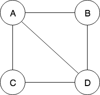

# DiVE - Distance Vector Routing Simulation

## Prerequisites

Faps has following dependencies:

- [asio](https://github.com/chriskohlhoff/asio)
- [spdlog](https://github.com/gabime/spdlog)
- [fmt](https://github.com/fmtlib/fmt)
- [json](https://github.com/nlohmann/json)
- [clipp](https://github.com/muellan/clipp)

## Installation

```sh
export ASIO_INCLUDE_PATH=~/clones/asio/asio/include/
export SPDLOG_INCLUDE_PATH=~/clones/spdlog/include/
export FMT_PATH=~/clones/fmt/
export JSON_INCLUDE_PATH=~/clones/json/single_include/
export CLIPP_INCLUDE_PATH=~/clones/clipp/include/

hg clone https://bitbucket.org/nicokratky/dive
cd dive
mkdir build
cd build
cmake ..
make
```

## Usage

```
SYNOPSIS
        ./router <topology file> <router id> [-i <seconds>] [-v]

OPTIONS
        -i, --interval
                    router update interval (default: 5)

        -v, --verbose
                    print additional debug information
```

## Example topology file

```json
{
    "nodes": {
        "A": {
            "ip_address": "127.0.0.1",
            "port": 16022
        },
        "B": {
            "ip_address": "127.0.0.1",
            "port": 16023
        },
        "C": {
            "ip_address": "127.0.0.1",
            "port": 16024
        },
        "D": {
            "ip_address": "127.0.0.1",
            "port": 16025
        }
    },
    "links": [
        {
            "source": "A",
            "target": "D"
        },
        {
            "source": "A",
            "target": "B"
        },
        {
            "source": "A",
            "target": "C"
        },
        {
            "source": "B",
            "target": "D"
        },
        {
            "source": "C",
            "target": "D"
        }
        ]
}
```

This will set the network that is shown in the picture below. The `pof` field in the links array determines the possibility of outage. This value can be any number between 0 and 1.



## Licence

Boost Software License
